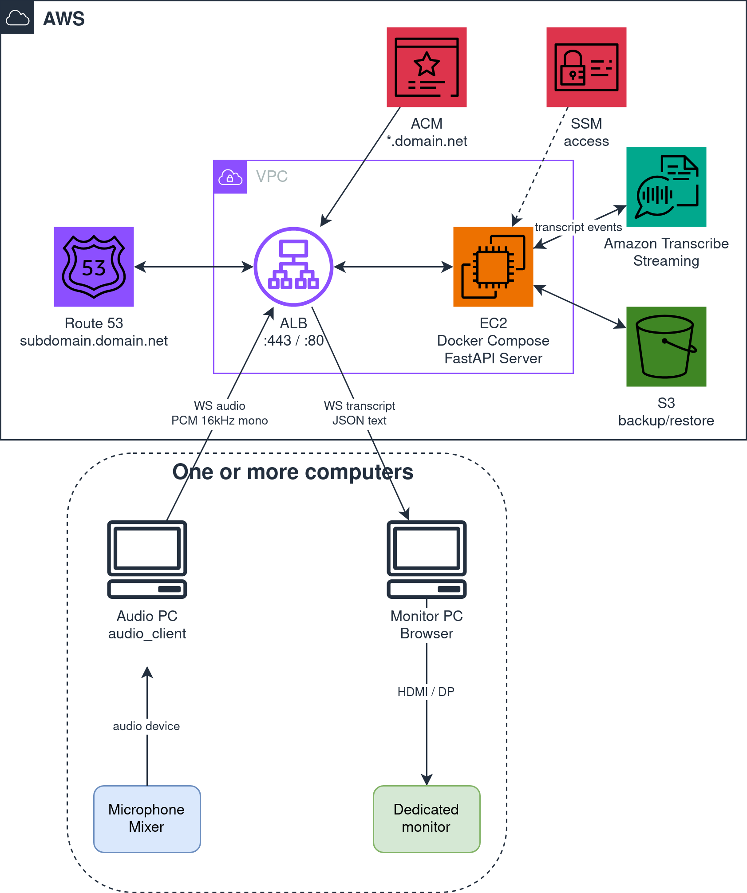

## Why all this interest in realtime transcription

It all started with the collaboration with PyCon IT. At PyCon IT 2025 they set up live transcription with local Whisper on a Graphics Processing Unit (GPU), based on the repo [`realtime-transcription-fastrtc`](https://github.com/sofdog-gh/realtime-transcription-fastrtc). With the YouTube videos used as tests, all good. With the real audio of a conference room, Whisper started hallucinating: a generative model, if you give it a signal it doesn't recognize, doesn't leave a blank, it writes something anyway.

For PyCon IT 2026 a different path was needed, on a non-negotiable anchor: no hallucinations. If the model doesn't hear, ok, skip a word. If it hears badly, ok, transcribe badly. But it must not write sentences I didn't say.

Fixing Whisper's hallucinations directly (Voice Activity Detection, tuning decoding parameters, logprob filters, fine-tuning, ..) would have been a separate effort: I didn't have the time, with everything else to build. A bigger Whisper I haven't tested. Other paid generative Speech To Text (STT) services either: they stay in the same category of a model that produces text token after token, so the structural risk of invention stays. To get out of the category, a managed service based on acoustic decoding was needed. And since it's PyCon, let's also grab the bonus of decoupling the pieces and writing it in a testable way.

## A model that gets it wrong but doesn't make it up

Let's start with the engine. Then with what's around it.

### STT: who gets it wrong, who makes it up

I didn't run empirical benchmarks on the three. The choice played out on two axes: **model structure** (generative or not) and **delivery** (self-hosted or managed). The properties in the table come from product documentation and from direct observation of Whisper at PyCon IT 2025, not from A/B tests.

| Criterion | Whisper local | Amazon Transcribe Streaming | Paid generative STT |
|---|---|---|---|
| Architecture | generative (autoregressive) | non-generative (acoustic decoding) | generative |
| Hallucinations structurally possible | yes | no | yes |
| Delivery | self-hosted | managed | managed |
| Setup | GPU + model | AWS credentials | credentials |
| Network dependency | no | yes | yes |
| Cost | on-site hardware | $0.024/min | variable |
| Declared latency | 1-15s end of segment | ~300ms partial | depends |

The most important criterion is architecture. A non-generative model cannot, by construction, add words it didn't hear: at worst it skips or gets it wrong. A generative model can. The other criteria (network, cost, latency) are secondary trade-offs, all acceptable for a conference context: there's internet, a 30-minute talk costs ~$0.72, partial results arrive in ~300ms.

Choice: Amazon Transcribe Streaming. Not because it's "the best" in absolute terms, but because it sits in the category that rules out at the root the problem we're here for. The repo [`video-to-text`](https://github.com/bilardi/video-to-text) I wrote on purpose to test Transcribe as an alternative to Whisper.

### New repo or fork of the old one ?

The other big choice: fork of `realtime-transcription-fastrtc` (the one already used at PyCon IT 2025), or a new repo that takes only the good pieces from the two predecessors (`realtime-transcription-fastrtc` and `video-to-text`) ?

| Criterion | Fork | New repo |
|---|---|---|
| Initial effort | low | medium |
| Fragile dependencies inherited | FastRTC v0.0.26 | none |
| Architecture | monolithic to dismantle | designed for the use case |
| Testability | inherits the existing scope | every component in isolation |

Choice: new repo. As a lazy developer one would be tempted to fork, but when a dependency is fragile (FastRTC v0.0.26 isn't a stable standard), a fork could cost more than a targeted rewrite.

From `realtime-transcription-fastrtc` I keep the `screen` layout (black background, large text) and the auto-scroll logic of the frontend. From `video-to-text` I take the `transcribe_service.py` module and the async pattern with `asyncio.Queue` + `asyncio.gather()`. The rest gets dropped.

### Architecture: monolithic or decoupled ?

As a lazy developer, I don't want to redo everything moving from Proof of Concept (PoC) to Minimum Viable Product (MVP). The two predecessors already have pieces that work (the `screen` layout of `realtime-transcription-fastrtc`, the `transcribe_service` of `video-to-text`), but they're pieces from different repos, made for different purposes. To recycle them, the modules need clear boundaries.

A decoupled architecture here means having three components as three separate processes that talk to each other over the network:
- the audio client, which captures audio from the system device and sends it to the server
- the server, which receives audio, manages the stream toward Amazon Transcribe, and publishes the text
- the display client, which receives the text from the server and shows it on the dedicated monitor

The alternative architecture is a single process (a single running program) that captures, transcribes, displays.

| Criterion | Monolithic | Decoupled |
|---|---|---|
| Deploy | a single binary | three components |
| Distribution across multiple computers | no | yes (native) |
| Testability | internal dependencies | each component in isolation |
| Communication overhead | none | network calls |

Choice: decoupled. It works both in development with everything on one computer (localhost), and at the conference with three separate computers: audio client in the control room near the mixer, server on any computer connected to the network, and display client on the computer that drives the monitor. The monolithic instead locks everything onto a single computer, and the code couples the components: tests and replacements require more work. With more rooms the bill gets worse: you'd need a full copy of the system per room (audio, server, display for each), whereas the decoupled shares a single server across all rooms, and each room only adds an audio-and-display client on the same computer, or, to avoid running a long cable across the room, a second display client near the monitor.

### Audio client: browser or standalone ?

The audio to transcribe has different sources depending on the context: laptop microphone in local tests, Universal Serial Bus (USB) or analog mixer in the room, browser loopback for live apps like StreamYard. Who picks up this flow and sends it to the server ?

Two candidates: the browser app with `getUserMedia` (`realtime-transcription-fastrtc`'s path), or a standalone Python script launched from the audio computer.

| Criterion | In the browser | Standalone Python script |
|---|---|---|
| System devices (mixer) | limited | full access |
| Browser dependency | yes | no |
| Testability | medium | high |

Choice: standalone Python with `sounddevice`. At a conference, audio doesn't come from the speaker's laptop microphone, but from a room mixer or a dedicated microphone connected via USB. The browser's Web Audio APIs don't expose virtual sinks and USB mixers as separate devices. Instead, a Python script with `sounddevice` sees all the devices the operating system exposes, loopback and mixer included.

### Protocol between audio client and server

`realtime-transcription-fastrtc` used Web Real-Time Communication (WebRTC); `video-to-text` instead WebSocket (WS). Which makes sense here ?

| Criterion | WebRTC | WS |
|---|---|---|
| Bidirectionality | required | not needed |
| Network setup | Network Address Translation (NAT), Traversal Using Relays around NAT (TURN), Interactive Connectivity Establishment (ICE) | none |
| Reliability | path-dependent | persistent connection |
| Complexity | high | low |

Choice: WS. The audio client sends, the server receives. Bidirectionality isn't needed, so WebRTC is overkill. Persistence, on the other hand, is: a talk lasts tens of minutes, audio goes in chunks every 100ms, and on the server the same pipe keeps the Amazon Transcribe stream open for the whole session. WS covers both without the WebRTC layers.

### Transcript channel between server and display

`realtime-transcription-fastrtc` used Server-Sent Events (SSE); `video-to-text` WS. Which here ?

| Criterion | SSE | WS |
|---|---|---|
| Fits the case | yes | yes |
| Tech already in use | no | yes (for audio) |
| Duplicate code | a second handler | same stack |

Choice: WS. SSE would technically be enough (unidirectional server -> client, fine for the transcript). But WS is already in the house for the audio channel: keeping a single technology means a single stack of handlers server-side and a single client-side library, instead of two.

### Partial results vs final

Amazon Transcribe sends both partials (text that changes until the segment is stable) and finals (stable). To compare the two delivery modes in the field, the display supports both via the `?partial=true|false` flag: picked at runtime, not at build.

| Criterion | Partial on by default | Partial off by default |
|---|---|---|
| Readability on the monitor | low (changing text) | high |
| Perceived latency | good | medium |

Choice: off by default. A dedicated monitor with text that writes, erases and rewrites is unpleasant to look at. Partials can be turned on via `?partial=true` on the display if in a specific room the delay of finals ends up bothering.

### Language: zero restart between talks

Amazon Transcribe wants the language when opening the stream (`language_code="it-IT"` or `"en-US"`). At PyCon, rooms have consecutive talks in different languages: Italian, English. Two paths: language as a global server configuration, or as a parameter per connection of the audio client.

| Criterion | Global in the server | Per-room parameter |
|---|---|---|
| Language change between talks | server restart | zero restart |
| Scalability to multiple rooms in parallel | all same language | each room its own |

Choice: per-room parameter. With the global version, a restart would be needed at every language change (or a proxy that discriminates per path, complicating things). With the per-room parameter, the server stays up for the whole day, and the audio client reopens at the next talk with the right language (`?lang=it-IT` or `?lang=en-US`). And it also works with multiple rooms in parallel: each room has its own language, independent of the others.

Concretely: every WS connection is an independent handler on FastAPI, and each opens its own Amazon Transcribe stream with its own language. There's no shared state between different streams, so the language of one room cannot affect another.

### Display: dynamic app or static HTML ?

In this case, the display is what the audience looks at: a dedicated monitor with text scrolling as it arrives. It must update in real time receiving messages from the server, but does nothing else: no forms, no interaction.

Two paths: a dynamic app (React, Vue or similar, with build and state management), or a static HTML page with a bit of JS that opens a WS and appends text.

| Criterion | Dynamic app | Static HTML + JS |
|---|---|---|
| Client-side state | possible | only via WS |
| Deploy | requires build | file served by the server |
| Reuse from `realtime-transcription-fastrtc` | no | yes (CSS + JS) |

Choice: static HTML. No client-side state needed: the browser opens the page, receives text via WS, shows it. No build. And the CSS of `realtime-transcription-fastrtc`'s `screen` mode gets reused as is.

### Choices at a glance

The `realtime-transcription` choices don't come out of nowhere: some are new decisions for the live use case, others are pieces lifted from the two predecessors. Here they are in a row, with the source of inspiration. For the sequence diagram with WS endpoints and message flow, see the [README of the repo](https://github.com/bilardi/realtime-transcription#architecture).

| Choice | Winning option | Criterion | Source |
|---|---|---|---|
| STT | Amazon Transcribe Streaming | no hallucinations | `video-to-text` (transcribe_service) |
| Repo | new | less tech debt | new |
| Architecture | decoupled (3 components) | reuse from predecessors, deploy flexibility | new |
| Audio client | standalone Python | full access to system devices | new |
| Audio protocol | WS | persistent connection, minimal network setup | new |
| Transcript channel | WS | single stack server + client | `video-to-text` |
| Partial vs final | flag `?partial=true\|false` | readability on the monitor | new |
| Language | per room | zero restart between talks, scales to more rooms | new |
| Display | static HTML | no build, reuse of existing work | `realtime-transcription-fastrtc` (CSS + JS `screen` mode) |

## The stories you only find when you plug things in

The real fun starts when you stop drawing and turn on the machines.

### The device number on Fedora

The first time I ran `uv run python -m audio_client --list-devices` I found myself facing a long list with the same hardware (my headphones in the docking station jack) showing up multiple times, with similar names and different IDs. On Linux several audio layers coexist (ALSA at the kernel, JACK for pro audio, PipeWire as a modern sound server) and `sounddevice` lists them all: each exposes the same device, each is a candidate on paper.

| Backend | Device ID | Outcome |
|---|---|---|
| ALSA | 1 | doesn't work as one might expect |
| JACK | 25 | doesn't work as one might expect |
| PipeWire (system default) | 20 | works (it's the active routing of the system) |

There's no logic that helps you pick a priori: it depends on what the system uses as default routing. On Fedora 41 it's PipeWire, so the "right" ID was 20. I tried all three before figuring out the logic.

Rule of thumb: if the audio doesn't get where it should, try all the candidates before touching the code.

### The browser loopback

One of the audio sources to transcribe is StreamYard, which is a browser app: the speaker's audio goes out of the browser to the system's default sink. `audio_client` with `sounddevice` can capture from system devices (microphone, USB mixer), but can't read directly from an app's output. A bridge is needed: a virtual sink the browser writes to, and whose monitor `audio_client` reads from.

On Linux with PipeWire (or PulseAudio) the bridge is `module-null-sink`. You load a sink called `loopback`, you move the browser's stream onto it, you point `audio_client` at the null-sink's monitor. It works on the first try, but there's a side effect: while the browser's stream is on the null-sink, I can't hear it on my headphones anymore. In the room it's not a problem (audio comes from the physical mixer, not from the laptop browser). In development, yes: I can't verify what I'm transcribing.

I tried three paths: two deaf, one hearing clearly.

| Approach | audio_client hears | Headphones hear | Notes |
|---|---|---|---|
| `module-null-sink` + move browser | yes | no | base setup, muted on the laptop |
| `module-combine-sink` with slaves | no | yes | failed |
| `module-null-sink` + `module-loopback` as a parallel branch | yes | yes (+~50ms) | adopted solution |

The path that works is `module-loopback` as a parallel branch. The null-sink `loopback` stays source for `audio_client`; on top you load a `module-loopback` that reads from the null-sink's monitor and writes to the default sink. Two independent consumers on the same monitor, neither blocks the other.

The ~50ms is `module-loopback`'s buffer. For the transcription nothing changes: the `audio_client` branch stays instant. The 50ms is only what I hear in headphones compared to what leaves the browser.

Everything is wrapped in two `make` commands: `make loopback_redirect APP=firefox` (which also accepts `MONITOR=1` for the listening branch to headphones) and `make loopback_clean` that cleans up.

Practical choice: default `MONITOR=0`. At the conference audio comes from the mixer, not the laptop, so hearing it locally isn't needed. `MONITOR=1` is a development luxury.

## How much hardware do you need ?

I haven't benchmarked the system on specific hardware yet, so I'm basing this on typical sizes of similar Python applications. Better to oversize than to pick the bare minimum: on a real deploy you want margin, not to crash on the first spike.

| Component | RAM/CPU | Recommended example | Notes |
|---|---|---|---|
| Audio client | ~50-100MB | Pi 4 2GB with USB mic | Pi 3 technically enough but tight |
| Server | ~100-200MB base + ~30-50MB per room | EC2 t4g.small (2GB, ARM) or Pi 4 4-8GB | Pi 4 handles 1-2 rooms; EC2 for more |
| Display client | ~200-300MB for Chromium | Pi 4 4GB | Pi 4 2GB technically enough but tight |

Three deploy scenarios:

| Scenario | Recommended device | When and why |
|---|---|---|
| All separate | Pi 4 2GB (audio) + EC2 t4g.small (server) + Pi 4 4GB (display) | Multi-room conference; server in cloud for sharing |
| All together | A laptop with 8GB, or a Pi 4 8GB with USB mic | Development, local demo |
| Audio + server together, display separate | Pi 4 8GB (audio+server) + Pi 4 4GB (display) | A single room, zero cloud; the audio Pi also hosts the server |

For one room, two Pis are enough. With a Pi 5 (server) you can push to 2-3 rooms; beyond that, EC2 is the way. EC2 or a more powerful laptop are natural upgrades anywhere, if you want more margin.

## Anything else to add ?

What's there today is good enough for one room, with any computer connected to the network. But the design holds beyond, when it's worth it.

### More rooms, same setup

If many rooms in parallel are needed, the infrastructure can be handled with [aws-docker-host](https://github.com/bilardi/aws-docker-host), which spins up an Elastic Compute Cloud (EC2) instance with Docker ready to use. The `realtime-transcription` server already ships with docker compose, and the opening image describes exactly this scenario.

### When one EC2 isn't enough: ECS Fargate

If there are many rooms and the load varies, a single static EC2 becomes tight. Fargate (part of Elastic Container Service, ECS) spins up tasks on-demand and shuts them down when needed. But live transcription lives on long-lived WS, and from the AWS documentation there are some points to configure with care (I haven't tested them on the project):

- **Sticky sessions**: a one-hour WS connection must stay on the same Fargate task. The Application Load Balancer (ALB) supports WS, but the session must be routed with affinity. No per-packet round-robin.
- **Idle timeout**: the ALB target group default is 60 seconds of inactivity. A 20-second pause between sentences isn't inactivity (the client sends silence every 100ms), but it's worth raising the timeout to a few minutes for safety.
- **Graceful shutdown**: during a deploy or a scale-in, the task that's closing must let open Transcribe streams finish, not cut off mid-talk. The container must handle `SIGTERM` and close the WSs gracefully, giving the client time to reconnect to a different task.

### Authentication on the WebSockets

Today the WSs are open: anyone who knows `/ws/audio/{sala}` can inject audio, anyone who knows `/ws/transcript/{sala}` can listen. For a deploy in a Local Area Network (LAN) or a private cloud on a Virtual Private Network (VPN) it's perfectly fine. On the public internet you need at least:

- a token in the path or query (e.g. `?token=...`), validated at connect
- rate limit per Internet Protocol (IP) on the audio channel
- permission separation: whoever can write on room X may not necessarily be allowed to read it

These are the minimum requirements to expose the endpoints on the public internet.
