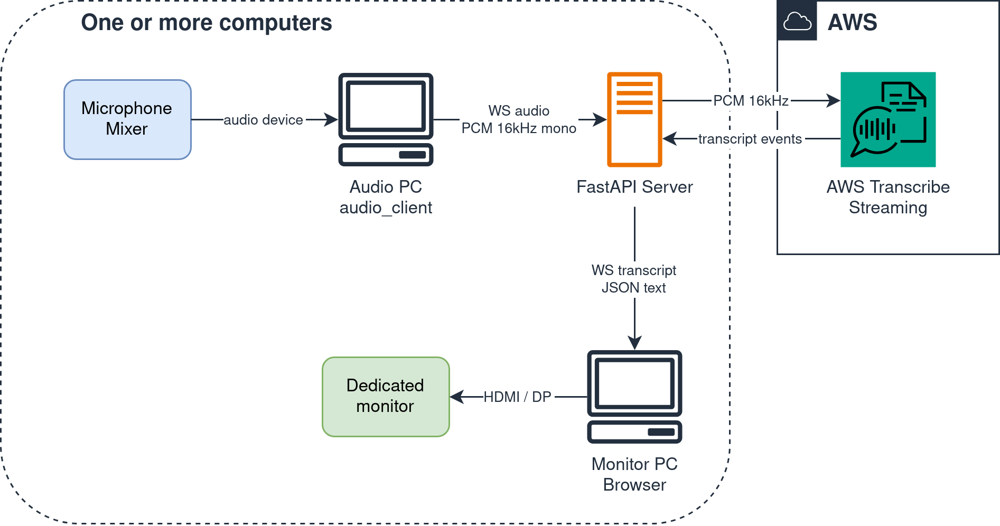
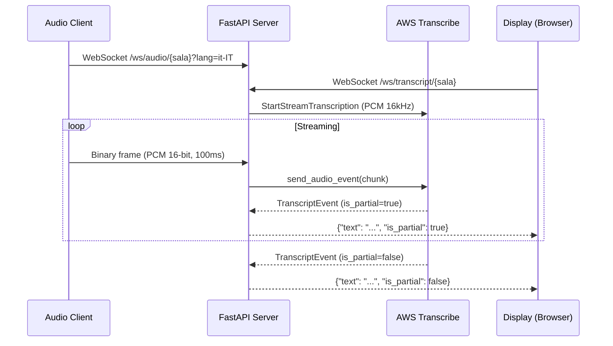

# Realtime transcription

Realtime transcription of conference talks, displayed on a dedicated monitor per room. Uses AWS Transcribe Streaming as the STT engine.

## Architecture





## How it works

Three decoupled components, connected via WebSocket to a central server:

1. **FastAPI server** (cloud or any PC): receives audio, forwards it to AWS Transcribe, publishes transcript text
2. **Audio client** (Python script): captures audio from a system device (microphone, mixer) and sends it to the server
3. **Display** (browser): connects to the server, receives text, renders it on a black background

### Endpoints

| Method | Path | Description |
|--------|------|-------------|
| `GET` | `/` | Redirect to active rooms list |
| `GET` | `/sala/{sala}` | Display page for a specific room |
| `GET` | `/api/sale` | Active rooms list (JSON) |
| `WS` | `/ws/audio/{sala}?lang=it-IT` | Receives PCM audio from the audio client |
| `WS` | `/ws/transcript/{sala}?partial=false` | Sends transcript text to displays |

## Security

- **`.env` is gitignored**: contains `AWS_PROFILE` and `AWS_REGION`, never committed
- **No authentication on WebSocket endpoints**: designed for trusted LAN or private cloud; do not expose to the public internet without adding auth
- **AWS credentials are not exposed to clients**: only the server communicates with AWS Transcribe

## Estimated costs

| Resource | Cost |
|----------|------|
| AWS Transcribe Streaming | $0.024/min |

A 30-minute talk costs ~$0.72. See the [AWS Transcribe pricing page](https://aws.amazon.com/transcribe/pricing/) for details.

## Prerequisites

### AWS credentials

Configure AWS credentials with a profile that has the `transcribe:StartStreamTranscription` permission:

```sh
aws configure --profile <your-profile>
```

See the [AWS CLI configuration guide](https://docs.aws.amazon.com/cli/latest/userguide/cli-configure-files.html) for details.

## Usage

### Cloud deploy (via aws-docker-host)

Use [bilardi/aws-docker-host](https://github.com/bilardi/aws-docker-host) to provision an EC2 instance with Docker:

```sh
git clone https://github.com/bilardi/aws-docker-host
cp -r realtime-transcription/{Dockerfile,docker-compose.yaml,.env.example,pyproject.toml,app,static,audio_client} aws-docker-host/inputs/
```

Then follow the [aws-docker-host README](https://github.com/bilardi/aws-docker-host#quick-start) to deploy. The audio client and display connect to the public URL of the instance.

### Local deploy

Run the server on a PC. All components (audio client, display) must be on the same local network. Only the server needs internet to reach AWS Transcribe.

```sh
# create .env from template
cp .env.example .env
# edit .env with your AWS profile

# start server
docker compose up
```

The audio client and display connect to the local IP of the server (e.g. `192.168.x.x:8000`).

### Audio client

```sh
# list audio devices
uv run python -m audio_client --list-devices

# send audio from default microphone to room "test"
uv run python -m audio_client --sala test --server ws://localhost:8000

# send audio from device 3 to room "auditorium" in Italian
uv run python -m audio_client --device 3 --sala auditorium --lang it-IT --server ws://localhost:8000

# send audio in English
uv run python -m audio_client --sala auditorium --lang en-US --server ws://localhost:8000
```

### Loopback (browser audio)

To transcribe audio from a browser application (YouTube, StreamYard, Zoom), you need a virtual loopback device. On Fedora/PipeWire:

```sh
# create loopback and redirect browser audio (APP = firefox, chromium, chrome, brave, ...)
make loopback_redirect APP=firefox  # silent (audio goes only to audio_client)
make loopback_redirect APP=firefox MONITOR=1  # also hear it on the default sink (~50ms latency on listening)

# find loopback device ID (needed for --device below)
uv run python -m audio_client --list-devices | grep -i loop

# start audio client with loopback device
uv run python -m audio_client --device <LOOPBACK_ID> --sala test --lang it-IT --server ws://localhost:8000

# cleanup: restore browser audio and remove loopback
make loopback_clean
```

While redirected to loopback, audio is not heard from speakers/headphones. Passing `MONITOR=1` enables a bridge back to the default sink so you can hear it too, but it adds ~50ms of latency on the listening path (the transcription path is unaffected). At a conference this is not needed: the audio comes from a physical microphone or mixer connected as a system device.

### Display

Open in browser: `http://localhost:8000/sala/test`

To also show partial results: `http://localhost:8000/sala/test?partial=true`

## Project structure

```
app/
    __init__.py  # package + version
    main.py  # FastAPI server: HTTP + WebSocket endpoints
    transcribe_service.py  # AWS Transcribe integration
    rooms.py  # room registry: maps sala -> display clients
audio_client/
    __init__.py  # package
    __main__.py  # entry point for python -m audio_client
    cli.py  # CLI: audio capture + WebSocket streaming
static/
    index.html  # display page (screen mode)
    client.js  # WebSocket client for display
tests/
    test_transcribe.py  # transcribe service tests
    test_rooms.py  # room registry tests
    test_api.py  # server endpoint tests
    test_audio_client.py  # audio client tests
pyproject.toml
Dockerfile
docker-compose.yaml
.env.example
```

## Development

Environment installation

```sh
pip install uv
uv python install 3.13
uv sync
```

Test tools

```sh
uv run pytest
uv run ruff check --no-fix .
uv run ruff format --check .
uv run pyright app/ audio_client/
```

Conventional Commits

```sh
# use one of the <type> before your message,
# according to the guide https://www.conventionalcommits.org/en/v1.0.0-beta.2/
git commit -m "feat: first version"
```

Versioning management

```sh
# use one of the following commands according to the guide https://semver.org/
make patch
make minor
make major
```

## Blog post

- [Italian](POST.it.md)
- [English](POST.en.md)

## License

This repo is released under the MIT license. See [LICENSE](LICENSE) for details.
